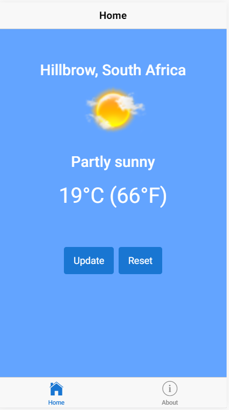

# MyWeather

MyWeather is an Ionic app that uses the AccuWeather API to show weather updates.

## Images

Below are screenshots of the application running on Google Chrome.

| iPhone 5/6/7 (iOS)  | Pixel 2 (Android) |
| ------------- | ------------- |
|   |   |
| App running on iPhone5/6/7 device emulator on Google Chrome  | App running on Google Pixel 2 device emulator on Google Chrome  |

## Install instructions

1. Make sure that you have the Ionic Framework installed. You can do so by using this command: `npm install -g ionic cordova`. For further instructions on installing the framework, follow the official instructions that can be found [here].

2. Clone the repository `https://github.com/TonyLancer/myweather.git`

3. Install the dependencies by running `npm install`
4. Run the app by running the command `ionic serve`. The app should open your default broswer on `http://localhost:8100`

[here]: https://ionicframework.com/docs/intro/installation/
